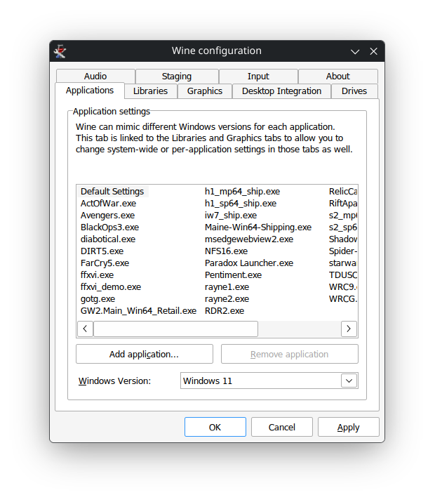
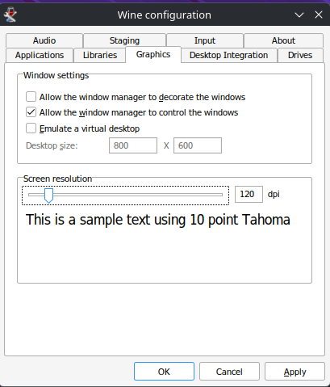
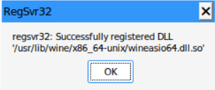

# Wine & DXVK Configuration

This section sets up Wine to run Windows audio applications (Amplitube/Tonex) with proper graphics support for the UI.

## Step 1: Initial Wine Configuration

Run the Wine configuration utility from your home directory:

```bash
winecfg
```

This opens the Wine configuration dialog and creates a `.wine` directory in your home folder (this is your Windows environment).

### Configuration Dialog



#### Application Tab
- **Windows Version**: Select **Windows 11**

This ensures compatibility with modern Windows applications like Amplitube and Tonex.

## Step 2: Graphics Settings

While still in `winecfg`, switch to the **Graphics** tab:



#### Recommended Settings
- **Uncheck**: "Windows decorations" 
  - This removes the window frame, giving better screen space and preventing conflicts with the audio plugin UI

- Leave other settings at defaults

Click **OK** to save and close.

## Step 3: Install DXVK (Vulkan Support)

DXVK is essential for the Amplitube and Tonex user interfaces to render properly. It provides Vulkan-based translation of Direct3D calls.

```bash
winetricks dxvk
```

**What this does:**
- Downloads and installs DXVK to your Wine prefix
- Converts Direct3D graphics calls to Vulkan (more efficient on Linux)
- Enables proper rendering of the audio plugin UIs

### Verification

After installation completes, you should see:
```
DXVK has been installed
```

## Step 4: Register WineASIO

Now that Wine is properly configured, register the ASIO audio driver:

```bash
wineasio-register
```

**What this does:**
- Registers WineASIO as an audio driver in your Wine installation
- Allows Amplitube and Tonex to use ASIO for audio I/O
- Enables low-latency audio processing

### Expected Output

You should see output confirming registration was successful.



---

## Understanding the Setup

### Why DXVK?
- **Better Performance**: Vulkan is more efficient than DirectX translation
- **GPU Acceleration**: Uses your GPU for rendering the plugin UI
- **Stability**: Tested with modern graphics cards

### Why Disable Windows Decorations?
- **Screen Space**: Maximizes usable area in the plugin window
- **UI Conflicts**: Some audio plugins have rendering issues with window decorations

### Why ASIO?
- **Professional Standard**: ASIO is the industry standard for low-latency audio on Windows
- **Direct Hardware Access**: Bypasses Windows audio stacking for lower latency
- **WineASIO Bridge**: Translates ASIO calls to PipeWire/JACK on Linux

## Next Steps

Proceed to [System Optimization](03-system-optimization.md) to prepare your system for real-time audio processing.

---

## Troubleshooting

**Q: `winecfg` opens but settings don't apply**  
A: Make sure to click **OK** to save before closing the dialog.

**Q: DXVK installation fails**  
A: Try `winetricks dxvk --force` to force reinstallation.

**Q: Graphics rendering is broken after DXVK install**  
A: This is unusual. Run `winetricks dxvk` again or try `winetricks dxvk=legacy` for older GPU support.

**Q: `wineasio-register` fails**  
A: Ensure you ran `sudo ln -s /usr/bin/wine /usr/bin/wine64` from the previous section.
