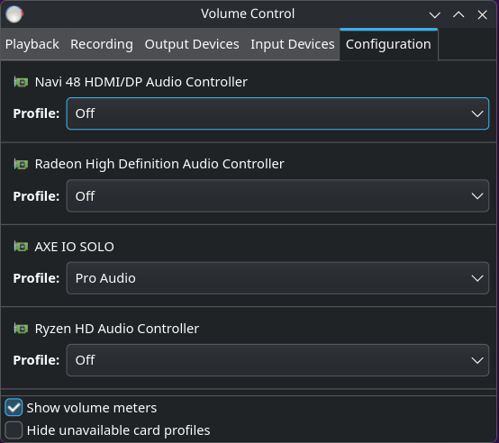
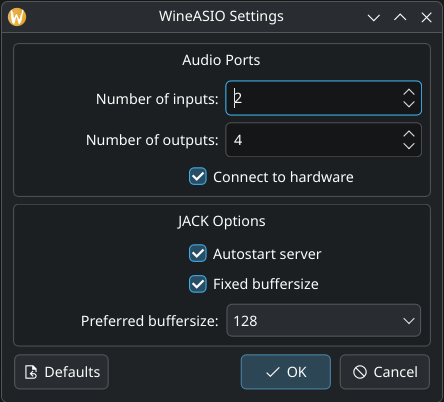

# Audio Interface Configuration with PipeWire/WirePlumber

This section configures PipeWire and WirePlumber for low-latency audio with your USB audio interface.

## Understanding the Audio Stack

- **PipeWire**: Modern audio server (replaces PulseAudio/JACK)
- **WirePlumber**: Session manager for PipeWire (handles device routing and configuration)
- **JACK Compatibility**: PipeWire provides native JACK support without separate installation

## Step 1: Create Configuration Directories

Create the necessary configuration folders:

```bash
mkdir -p $HOME/.config/wireplumber/wireplumber.conf.d
mkdir -p $HOME/.config/pipewire/pipewire.conf.d
mkdir -p $HOME/.config/pipewire/jack.conf.d
```

## Step 2: Identify Your Audio Interface

Connect your USB audio interface and identify its name and node paths:

```bash
pw-cli list-objects Device | grep device.nick
```

### Example Output

```
device.nick = "HDA ATI HDMI"
device.nick = "HD-Audio Generic"
device.nick = "AXE I/O SOLO"
device.nick = "HD-Audio Generic"
```

**Your audio interface will be one of these** (usually the most recognizable name, like "AXE I/O SOLO").

### Find the Node Name

To apply settings to all nodes (inputs and outputs) of your interface, find the `node.name`:

```bash
pw-cli ls Node | grep "node.name"
```

### Example Output

```
node.name = "Dummy-Driver"
node.name = "Freewheel-Driver"
node.name = "Midi-Bridge"
node.name = "bluez_midi.server"
node.name = "alsa_output.usb-IK_Multimedia_AXE_IO_SOLO_XXXXXXX-XX.pro-output-0"
node.name = "alsa_input.usb-IK_Multimedia_AXE_IO_SOLO_XXXXXXX-XX.pro-input-0"
```

**Identify the pattern**: Look for `node.name` entries starting with `alsa_output` or `alsa_input` that contain your interface name. In this example, the pattern is `~alsa_*.usb-IK_Multimedia_AXE_IO_SOLO*` (matching both input and output nodes).

## Step 3: Configure WirePlumber for Your Interface

Create device-specific WirePlumber configuration:

```bash
nano $HOME/.config/wireplumber/wireplumber.conf.d/90-my_audio_interface.conf
```

Add this configuration, **replacing the `node.name` pattern with your device's name pattern**:

```ini
monitor.alsa.rules = [
  {
    matches = [
      { node.name = "~alsa_*.usb-IK_Multimedia_AXE_IO_SOLO*" },
    ]
    actions = {
      update-props = {
        api.alsa.period-size = 128
        api.alsa.headroom = 0
        api.alsa.period-num = 3
        audio.rate = 48000
        node.latency = 128/48000
        node.max-latency = 128/48000
        api.alsa.disable-batch = true
      }
    }
  }
]
```

### Configuration Explanation

| Parameter | Value | Why |
|-----------|-------|-----|
| `node.name` | `~alsa_*.usb-IK_Multimedia_AXE_IO_SOLO*` | Matches all nodes (input/output) of your interface using a wildcard pattern. The `~` prefix enables glob matching. |
| `api.alsa.period-size` | 128 | Buffer size in samples (lower = lower latency but more CPU) |
| `api.alsa.headroom` | 0 | Extra buffer headroom in samples (0 = minimum latency) |
| `api.alsa.period-num` | 2 | Number of periods (2 = minimum for stable operation) |
| `audio.rate` | 48000 | Sample rate in Hz (48kHz is professional standard) |
| `node.latency` | 128/48000 | Target latency = 128 samples at 48kHz = 2.67ms |
| `node.max-latency` | 128/48000 | Maximum allowed latency (locks latency to target) |
| `api.alsa.disable-batch` | true | Disables batch mode for lower latency (may increase CPU usage) |

### Deriving the Pattern for Other Interfaces

1. Run `pw-cli ls Node | grep "node.name"`
2. Find lines starting with `alsa_output` or `alsa_input` containing your interface name
3. Identify the unique part of the name (e.g., manufacturer and model)
4. Create a pattern: `~alsa_*.<unique-identifier>*`
   - `~` enables glob matching
   - `alsa_*` matches both `alsa_output` and `alsa_input`
   - `*` at the end matches any suffix

**Common patterns:**
| Device | node.name pattern |
|--------|-------------------|
| AXE I/O Solo | `~alsa_*.usb-IK_Multimedia_AXE_IO_SOLO*` |
| Focusrite Scarlett | `~alsa_*.usb-Focusrite_Scarlett*` |
| MOTU Audio | `~alsa_*.usb-MOTU*` |
| Generic USB Audio | `~alsa_*.usb-*` |

## Step 4: Configure PipeWire Real-Time Settings

Create PipeWire real-time configuration:

```bash
nano $HOME/.config/pipewire/pipewire.conf.d/99-rt.conf
```

Add:

```ini
context.properties = {
    default.clock.rate          = 48000
    default.clock.allowed-rates = [ 48000 ]
    default.clock.quantum       = 128
    default.clock.min-quantum   = 128
    default.clock.max-quantum   = 128
    default.clock.quantum-limit = 128

    # Real-time tuning
    realtime.priority           = 88
    realtime.cpu-load.threshold = 0.85
}
```

### Configuration Explanation

| Parameter | Value | Why |
|-----------|-------|-----|
| `default.clock.rate` | 48000 | Global sample rate (matches interface) |
| `default.clock.allowed-rates` | [ 48000 ] | Restricts allowed sample rates to prevent automatic switching |
| `default.clock.quantum` | 128 | Processing quantum (buffer size, in frames) used by the PipeWire audio graph |
| `default.clock.min-quantum` | 128 | Minimum quantum size (prevents going lower) |
| `default.clock.max-quantum` | 128 | Maximum quantum size (prevents going higher) |
| `default.clock.quantum-limit` | 128 | Hard limit on quantum size (locks to target) |
| `realtime.priority` | 88 | Real-time scheduling priority (high but not maximum) |
| `realtime.cpu-load.threshold` | 0.85 | Alert if CPU usage exceeds 85% |

## Step 5: Configure JACK Compatibility Settings

Create JACK-specific settings:

```bash
nano $HOME/.config/pipewire/jack.conf.d/custom.conf
```

Add:

```ini
jack.properties = {
    node.latency       = 128/48000
    node.lock-quantum  = true
}
```

### Configuration Explanation

| Parameter | Value | Why |
|-----------|-------|-----|
| `node.latency` | 128/48000 | Latency = 128 samples at 48kHz = 2.67ms per direction |
| `node.lock-quantum` | true | Prevents quantum changes (ensures stability) |

## Step 6: Apply Configuration Changes

Restart the audio services:

```bash
systemctl --user restart wireplumber pipewire pipewire-pulse
```

**What this does:**
- Reloads all configuration files
- Restarts the audio daemon with new settings
- Takes effect immediately

### Verify Services Running

```bash
systemctl --user status wireplumber pipewire
```

Both should show `active (running)`.

## Step 7: Configure Audio Profiles

Use PulseAudio Volume Control to set the audio interface profile:

```bash
pavucontrol
```

### Steps in pavucontrol

1. Open the **Configuration** tab
2. For each audio device listed:
   - Set to **Off** (internal audio devices like HDMI, HD-Audio Generic)
   - **EXCEPT** your audio interface (AXE I/O Solo)
3. For your audio interface:
   - Select **Pro Audio** profile
   - This disables echo cancellation/noise suppression that adds latency



### Pro Audio Profile

- Minimizes processing overhead
- Disables automatic features that add latency
- Provides maximum control over audio routing

## Step 8: Verify Configuration

Check current audio configuration:

```bash
pw-cli info 0
```

Look for:
- `clock.rate = 48000`
- `clock.quantum = 128`

If these match your configuration, you're set!

---

## Common Interface Names

| Device | device.nick |
|--------|------------|
| AXE I/O Solo | "AXE I/O SOLO" |
| Focusrite Scarlett | "Scarlett" |
| MOTU Audio | "MOTU" |
| RME Fireface | "Fireface" |
| Built-in Audio | "HD-Audio Generic" or "HDA..." |

If your interface isn't listed, connect it and run `pw-cli list-objects Device` again.

## Step 9: WineASIO configuration
Run `wineasio-settings` and configure the channels for your audio interface. For example, set 2 input channels and 4 output channels (adjust according to your specific hardware). Set the buffer size to 128 samples, as shown in the figure below.

> **Note:** These settings may not always be used, as some applications override them with their own configuration.




## Next Steps

Proceed to [Latency Testing](05-latency-testing.md) to measure your system's actual latency.

---

## Troubleshooting

**Q: `pavucontrol` doesn't show my audio interface**  
A: 
1. Ensure interface is connected and powered on
2. Run `pw-cli list-objects Device` to verify it's detected
3. Restart PipeWire: `systemctl --user restart pipewire`
4. Reopen `pavucontrol`

**Q: Pro Audio profile not available**  
A: Your interface may not support it. Select the profile with the most outputs (usually "Stereo" or similar).

**Q: Configuration changes don't apply**  
A: Ensure you're editing files in `$HOME/.config/` (not `/etc/`) and ran the restart command after editing.

**Q: Audio interface not detected at all**  
A: 
1. Check connection: `lsusb -v 2>/dev/null | grep -E "idProduct|bInterfaceClass" | grep -B2 "Audio"`
2. Load ALSA kernel module: `sudo modprobe snd_usb_audio`
3. Restart PipeWire: `systemctl --user restart wireplumber pipewire`

**Q: Getting "Failed to connect" errors**  
A: This usually means the interface configuration has a syntax error. Check the `.conf` files for typos, especially the `device.nick` name must match exactly (including case).
