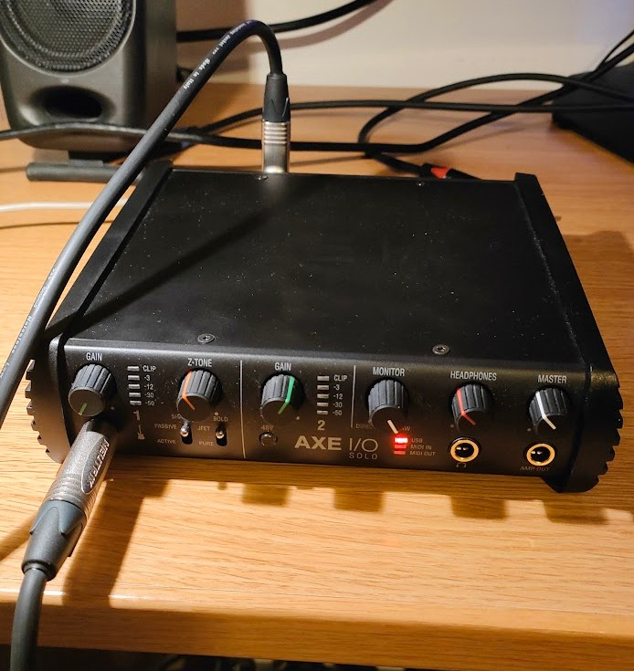
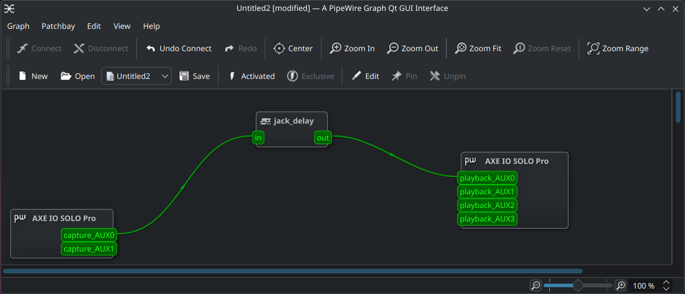

# Latency Testing and Verification

This section explains how to measure your system's actual audio latency using the `jack_iodelay` tool. Achieving low latency is critical for real-time guitar playing.

## Understanding Latency

**Latency** is the time delay between input and output. For guitar playing:

- **< 5ms**: Imperceptible (perfect)
- **5-10ms**: Acceptable (minimal perception)
- **10-20ms**: Noticeable but playable
- **> 20ms**: Unplayable (too much lag)

**Round-trip latency** = input latency + processing latency + output latency

## Step 1: Physical Setup

Set up a loopback cable for testing:

1. **Connect a guitar cable** from your audio interface's **instrument input** to the interface's **stereo output**
   - This creates a direct hardware feedback path
   - The cable physically loops the audio back

2. Or, if you have balanced outputs:
   - Input: instrument input (1/4" jack)
   - Output: main stereo balanced output (XLR)



## Step 2: Start the Latency Measurement Tool

Open a terminal and run:

```bash
jack_iodelay
```

You should see output like:

```
jack_iodelay started
Signal below the noise floor
Waiting for signal
```

The tool is now listening for audio and will measure the delay.

## Step 3: Route Audio Using qpwgraph

Open the PipeWire graph visualizer:

```bash
qpwgraph
```

This shows all audio connections as a visual graph.

### Making the Connections

In qpwgraph:

1. **Find your audio interface capture ports**:
   - Usually labeled: `<interface_name>:capture_AUX0` or similar

2. **Find the jack_iodelay ports**:
   - Input port: `jack_iodelay:input`
   - Output port: `jack_iodelay:output`

3. **Create connections**:
   - Connect: Interface capture → `jack_iodelay:input`
   - Connect: `jack_iodelay:output` → Interface playback
   - The audio loops back through the measurement tool



### Visual Connection Flow

```
Guitar Input → Interface Capture → jack_iodelay → Interface Playback → Speakers/Headphones
```

## Step 4: Read the Latency Measurement

Once connected, audio flows through the loopback, and `jack_iodelay` measures the round-trip delay.

Watch the terminal where you started `jack_iodelay`. It will display:

```
   329.752 frames      6.870 ms total roundtrip latency
        extra loopback latency: 73 frames
        use 36 for the backend arguments -I and -O
   329.752 frames      6.870 ms total roundtrip latency
        extra loopback latency: 73 frames
        use 36 for the backend arguments -I and -O
```

or similar. This is your **total latency**.

### What the Number Means

For **128 samples at 48kHz**:
- Expected latency ≈ 2.67ms per direction × 2 directions ≈ **5.34ms minimum**
- Interface/JACK overhead typically adds ≈ 1-2ms
- **Target: 6-8ms round-trip**

## Step 5: Analyze Results

### Expected Measurements

| Latency | Status | Action |
|---------|--------|--------|
| 5-8ms | ✓ Optimal | Ready for guitar playing |
| 8-12ms | ✓ Good | Minor overhead, still usable |
| 12-20ms | ⚠ Marginal | Noticeable but playable |
| 20-50ms | ✗ Poor | Configuration needs review |
| 50ms+ | ✗ Critical | Major issue, see troubleshooting |

### Interpreting High Latency

If your measurement is higher than expected:

1. **Check buffer settings**: Reconfirm `period-size = 128` in WirePlumber config
2. **USB cable**: Try a different USB port (USB 3 preferred for consistency)
3. **Background processes**: Close unnecessary applications
4. **CPU load**: Check `top` command - audio processes should have real-time priority

## Step 6: Clean Up

After testing, stop `jack_iodelay`:

Press **Ctrl+C** in the terminal where it's running.

In qpwgraph, disconnect the measurement connections before using the interface for actual audio.


## Troubleshooting High Latency

### Latency > 30ms

**Possible causes:**

1. **Wrong buffer size in config**
   - Run `pw-cli info 0` and check `clock.quantum`
   - Should be 128 (not higher)

2. **Interface using wrong period size**
   - Verify WirePlumber config matches device
   - Run: `pw-dump | grep period`

3. **USB issues**
   - Try different USB port
   - Check with `lsusb` that device is recognized
   - For USB 2.0 devices, may have inherent latency

4. **CPU throttling**
   - Verify: `cat /sys/devices/system/cpu/cpu0/cpufreq/scaling_governor` should show "performance"
   - Re-run: `sudo cpupower frequency-set -g performance`

### No Signal in jack_iodelay

1. **Check qpwgraph connections**
   - Ensure cables are actually connected (colored lines)
   - Try disconnecting and reconnecting

2. **Interface not routing audio**
   - Verify interface is on in pavucontrol
   - Check interface physical volume knobs (if present)

3. **JACK not running**
   - Verify: `systemctl --user status pipewire`
   - Restart: `systemctl --user restart pipewire`

### Intermittent Measurements

If jack_iodelay shows varying values:

1. **CPU load fluctuation**
   - Close other applications
   - Kill background processes: `killall firefox chromium`
   - Check `top` during measurement

2. **Interface dropout**
   - May indicate buffer underruns
   - Try larger buffer: change `period-size` to 256
   - This increases latency but improves stability

## Real-World Example: AXE I/O Solo

Expected performance:
- **Buffer**: 128 samples @ 48kHz
- **Latency**: 6-7ms round-trip
- **Stability**: Very consistent (variations < 0.5ms)

If you have different hardware, latency may vary by ±1-2ms.

## Next Steps

Once you've confirmed acceptable latency (< 12ms), proceed to [IK Multimedia Installation](06-ik-multimedia.md) to install Amplitube and Tonex.

---

## Video Demonstration

See [Jack_delay_test.mp4](resources/jack_delay_test.mp4) for a video showing the latency testing procedure.
