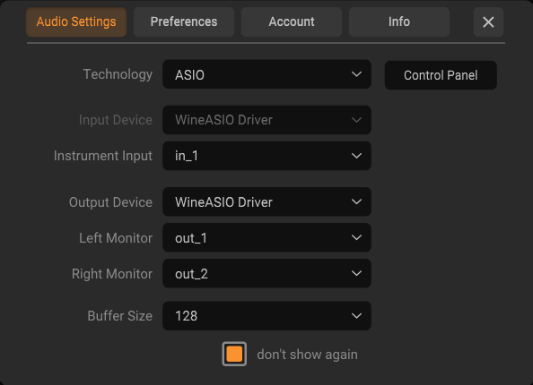
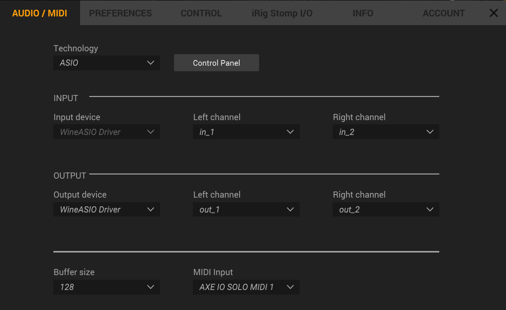

# IK Multimedia Installation: Amplitube & Tonex

This final section covers downloading, installing, and running Amplitube and Tonex through Wine.

## Step 1: Download IK Product Manager

IK Product Manager is the official tool for managing IK Multimedia software installations.

### Download

Visit: [IK Product Manager for Windows](https://www.ikmultimedia.com/products/productmanager/)

Download the Windows version (even though we're on Linux, we'll run it through Wine).

The file will be named something like: `ik_product_manager_1.1.10.zip`

### Move to Downloads

```bash
# If downloaded, it's likely in ~/Downloads already
ls ~/Downloads/ik_product_manager_*.zip
```

## Step 2: Install IK Product Manager

Install through Wine:

```bash
wine ~/Downloads/ik_product_manager_1.1.10.zip
```

Replace `1.1.10` with your actual version number.

### Installation Process

1. Wine will extract and run the installer
2. Follow the Windows installer prompts (same as on Windows)
3. Accept the license agreement
4. Choose installation location (default is fine)
5. Complete the installation

### Expected Result

The installer will create:
- `~/.wine/drive_c/Program Files/IK Multimedia/IK Product Manager/`

And place an icon on your desktop.

## Step 3: Launch IK Product Manager

### Option A: Using the Desktop Icon

Simply double-click the "IK Product Manager" icon on your desktop.

### Option B: Command Line

```bash
wine ~/.wine/drive_c/Program\ Files/IK\ Multimedia/IK\ Product\ Manager/IK\ Product\ Manager.exe
```

**Note**: This is useful if you want to create a launcher script or terminal alias.


## Step 4: Install Amplitube and Tonex

Once IK Product Manager is running:

1. **Log in** to your IK Multimedia account (create one if needed)
2. Browse available products
3. **Download and Install** both:
   - **TONEX** - Tone capture and modeling
   - **Amplitube** - Guitar amplifier and effects

### Installation Process

This is identical to Windows:
1. Select the product
2. Click "Install"
3. Choose installation location (default is fine)
4. Wait for download and installation
5. Product appears in your "My Products" list

The installation typically goes to:
- `~/.wine/drive_c/Program Files/IK Multimedia/TONEX/`
- `~/.wine/drive_c/Program Files/IK Multimedia/Amplitube/`

## Step 5: Run Tonex with Real-Time Priority

Tonex should be launched with real-time scheduling for optimal performance:

```bash
chrt -f 70 wine ~/.wine/drive_c/Program\ Files/IK\ Multimedia/TONEX/TONEX.exe
```

### What This Command Does

- **`chrt -f 70`**: Runs the program with FIFO real-time scheduling at priority 70
- **-f**: FIFO scheduling (strict real-time)
- **70**: Priority level (0-99, where 99 is highest)
- **wine ...**: Runs the application through Wine

### First Launch Configuration

When Tonex starts:

1. **Audio Driver Settings**:
   - Select **WineASIO** as the audio driver
   - The sample rate is automatically set to **48000 Hz**
   - The buffer is automatically set to **128 samples**

2. **Input/Output Configuration**:
   - Input: Select your audio interface input
   - Output: Select your audio interface output

3. **Save Settings**:
   - These persist for future launches



### Create a Launcher Script (Optional)

For convenience, create a script to launch Tonex:

```bash
nano ~/launch_tonex.sh
```

Add:

```bash
#!/bin/bash
chrt -f 70 wine ~/.wine/drive_c/Program\ Files/IK\ Multimedia/TONEX/TONEX.exe
```

Save and make executable:

```bash
chmod +x ~/launch_tonex.sh
```

Then launch with:

```bash
~/launch_tonex.sh
```

## Step 7: Run Amplitube

Amplitube can be launched similarly:

```bash
chrt -f 70 wine ~/.wine/drive_c/Program\ Files/IK\ Multimedia/Amplitube/Amplitube.exe
```

### First Launch

1. Configure **WineASIO** as audio driver
   - The sample rate is automatically set to **48000 Hz**
   - The buffer is automatically set to **128 samples**
2. Select your audio interface inputs/outputs




## Step 8: Using Amplitube and Tonex

### Initial Setup in Amplitube/Tonex

1. **Connect your guitar** to the audio interface input
2. **Set input volume** on interface (not in software)
3. **Monitor output** from interface (speakers/headphones)
4. **Load a preset** and play

### Playing in Real-Time

With proper configuration:
- You should hear your guitar signal with effects/modeling applied
- Latency should be imperceptible (< 8ms)
- Audio should be clean without crackles or pops

### If Audio is Distorted

1. **Lower input level** on interface
2. **Lower input gain** in software
3. **Check buffer**: If buffer is too small, increase to 256

### If Latency is High

1. Verify you ran the optimization steps (Section 3)
2. Run `rtcqs` to check real-time configuration
3. Check `jack_iodelay` measurement
4. Close other applications to reduce CPU load

## Running Amplitube as a Plugin

To be completed.

## Troubleshooting

### Amplitube/Tonex Won't Start

**Error: "Wine prefix not found"**
- Ensure you completed the Wine setup in Section 2
- Verify `.wine/` directory exists: `ls ~/.wine/`

**Error: "ASIO driver not found"**
- Ensure `wineasio-settings` was run
- Run `wineasio-register` again
- Restart PipeWire: `systemctl --user restart pipewire`

### Audio Crackling/Pops

1. **Increase buffer size**: Try 256 samples instead of 128
2. **Lower input signal**: Reduce gain at interface
3. **Close applications**: Too much CPU load
4. **Check real-time**: Run `rtcqs` to verify configuration

### No Audio Input

1. **Check qpwgraph**: Ensure interface input is connected
2. **Verify interface**: `pw-cli list-objects Device`
3. **Check interface volume**: Physical volume knobs on interface
4. **Select input in software**: Make sure Amplitube has correct input selected

### Audio Input but No Output

1. **Check output selection**: Amplitube output should route to interface
2. **Verify interface output** is active
3. **Check system volume**: Not muted
4. **Test with pavucontrol**: Manually route audio to hear it

### High Latency (> 12ms)

1. **Verify buffer settings**: Should be 128 samples at 48kHz
2. **Check CPU load**: `top` - should not exceed 85%
3. **Run with real-time priority**: Use `chrt -f 70` prefix
4. **Disable other effects**: Each effect adds processing time

### The mouse cursor disappears (in Amplitube)
- This can happen if you switch focus away from AmpliTube to another application, for example during AmpliTube startup.
- As a workaround, quickly move the mouse pointer in circles until it reappears (often at a larger size). Then click on an 
  AmpliTube menu or GUI element until the mouse cursor becomes visible again over the application.

## Performance Tips

### Optimize for Maximum Stability

1. **Close web browsers** - They consume CPU and cause latency spikes
2. **Disable system notifications** - Interrupts can break real-time
3. **Use headphones** - Direct connection to interface, no system speakers
4. **Monitor CPU** - Use `top` to watch usage; keep below 80%

### Use Fewer Effects

- Start with 1-2 effects
- Add more as needed
- Too many effects = high CPU usage = latency/dropouts

### Adjust Buffer if Needed

- **128 samples**: Lowest latency, needs good CPU
- **256 samples**: Better stability, ~5ms more latency
- **512 samples**: Very stable but ~10ms more latency

## Next Steps

You're now ready to:
- Create presets in Amplitube/Tonex
- Record your playing with a DAW
- Use Tonex's capture feature to model amplifiers
- Experiment with different effects combinations

## Additional Resources

- [Wine FAQ](https://wiki.winehq.org/FAQ)
- [PipeWire Documentation](https://pipewire.org/)
- [CachyOS Wiki](https://wiki.cachyos.org/)

---

## Summary

You now have a fully configured real-time guitar processing environment on CachyOS featuring:

✓ Wine with Windows 11 environment  
✓ DXVK for GPU-accelerated graphics  
✓ WineASIO for low-latency audio  
✓ PipeWire with real-time JACK compatibility  
✓ Optimized kernel for real-time performance  
✓ Low-latency audio interface routing (< 8ms)  
✓ IK Multimedia Amplitube & Tonex installed and running  

**Happy playing! 🎸**
