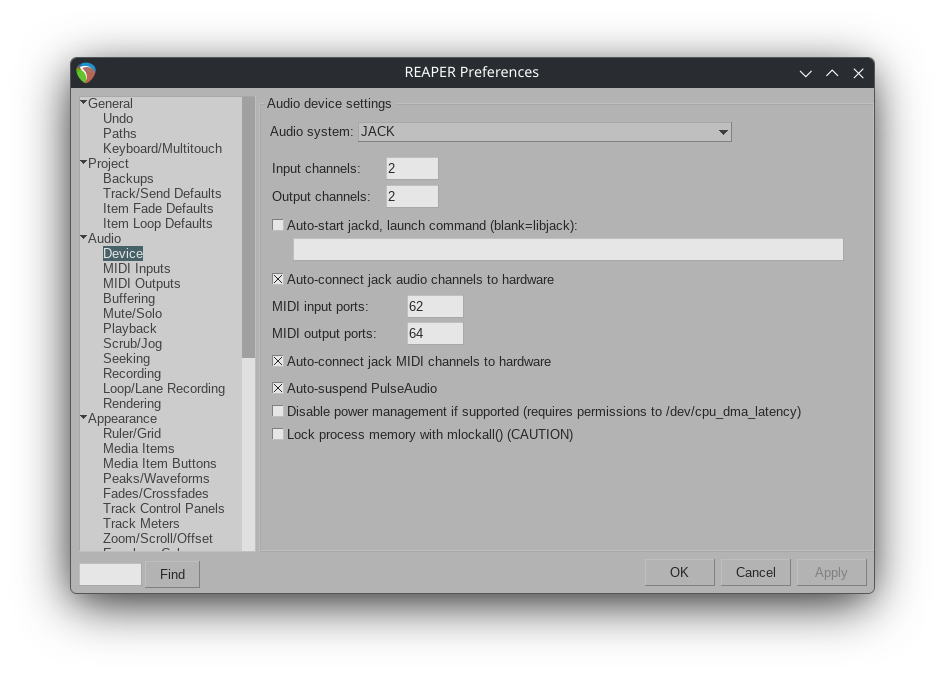
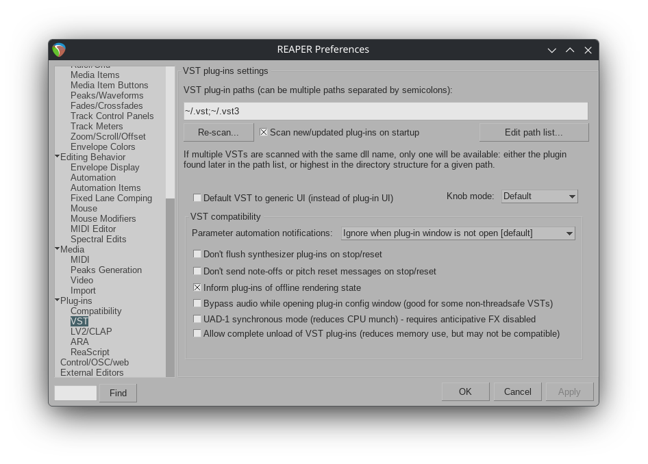
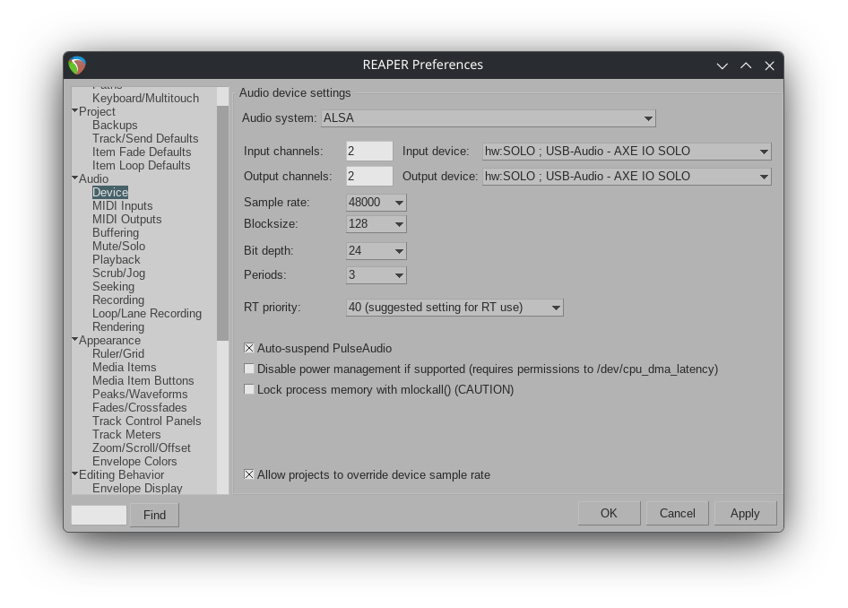

# DAW and VST Plugins with Reaper and Yabridge

This section covers installing Reaper, configuring yabridge to bridge Windows VST plugins, and setting up Amplitube and TONEX as VST3 plugins.

## Understanding the Plugin Bridge

- **Reaper**: Professional DAW that runs natively on Linux
- **Yabridge**: Bridges Windows VST/VST3 plugins to work in Linux DAWs
- **Wine**: Required by yabridge to run Windows plugin binaries

## Step 1: Install Reaper

### Option A: From CachyOS Repository (Recommended)

```bash
sudo pacman -S reaper
```

### Option B: Official Download

Visit: [Reaper Download](https://www.reaper.fm/download.php)

Download the Linux version and install:

```bash
tar -xf reaper*_linux_x86_64.tar.xz
cd reaper_linux_x86_64
./install-reaper.sh
```

## Step 2: Install Yabridge

Yabridge allows Windows VST2/VST3 plugins to run in Linux DAWs.

### Install from CachyOS Repository (Recommended)

```bash
sudo pacman -S yabridge yabridgectl
```

This installs:
- **yabridge**: The plugin bridge itself
- **yabridgectl**: Command-line tool to manage bridged plugins

> **Note:** Yabridge works seamlessly with `wine-cachyos`. No fixes or patches are needed for Wine 10.

### Verify Installation

```bash
yabridgectl --version
```

## Step 3: Configure Plugin Directories

Tell yabridge where your Windows VST3 plugins are located.

### Add IK Multimedia Plugin Path

```bash
yabridgectl add "$HOME/.wine/drive_c/Program Files/Common Files/VST3"
```

This directory contains the VST3 plugins installed by IK Product Manager, including:
- `TONEX.vst3`
- `AmpliTube 5.vst3`

### Verify Plugin Path

```bash
yabridgectl list
```

You should see the path you just added.

## Step 4: Sync Plugins

Yabridge creates Linux-compatible copies of Windows plugins:

```bash
yabridgectl sync
```

### Expected Output

```
❯ yabridgectl sync
Setting up VST2, VST3, and CLAP plugins using:
- /usr/lib/libyabridge-chainloader-vst2.so
- /usr/lib/libyabridge-chainloader-vst3.so
- /usr/lib/libyabridge-chainloader-clap.so

Finished setting up 2 plugins (2 new), skipped 0 non-plugin .dll files
```

where the 2 plugins are AmpliTube 5.vst3 and TONEX.vst3. You can verify the status also with the command

```bash
yabridgectl status
```

### What This Does

- Creates bridged `.vst3` files in `~/.vst3/yabridge/`
- These bridged plugins can be loaded by any Linux DAW
- The original Windows plugins remain untouched

## Step 5: Launch Reaper with Real-Time Priority

For optimal audio performance, launch Reaper with real-time scheduling:

```bash
WINEDEBUG=-all chrt -f 70 reaper
```

### Create a Launcher Script (Optional)

```bash
nano ~/launch_reaper.sh
```

Add:

```bash
#!/bin/bash
WINEDEBUG=-all chrt -f 70 reaper
```

Save and make executable:

```bash
chmod +x ~/launch_reaper.sh
```

## Step 6: Configure Reaper Audio Settings

### Open Preferences

In Reaper, go to: **Options → Preferences** (or press `Ctrl+P`)

### Audio Device Settings

Navigate to **Audio → Device**:

1. **Audio system**: Select **JACK**
2. **Sample rate**: 48000 Hz (matches PipeWire config)
3. **Block size**: 128 samples (matches PipeWire config)



### Why JACK?

- PipeWire provides JACK compatibility natively
- JACK offers low latency and stability in Reaper on Linux
- Direct integration with your PipeWire audio graph


## Step 7: Add VST3 Plugin Paths in Reaper

Configure Reaper to find the bridged plugins.

### Open VST Settings

In Reaper, go to: **Options → Preferences → Plug-ins → VST**

### Add Plugin Path

Check the VST settings in Reaper. It should already include the `~/.vst` and `~\vst3` folders, as show in the picture below:



If not, add the yabridge plugin directory:

```
~/.vst3/yabridge
```

Or the full path:

```
/home/yourusername/.vst3/yabridge
```

### Rescan Plugins

Click **Re-scan** to detect the bridged plugins.

## Step 8: Load Amplitube or TONEX in a Track

### Create a New Track

Press `Ctrl+T` or go to **Track → Insert new track**

### Add Plugin

1. Click the **FX** button on the track
2. Search for "Amplitube" or "TONEX"
3. Select the VST3 version
4. Click **Add**

### First Load

The first time you load a bridged plugin:
- Wine may take a moment to initialize
- The plugin window will appear
- Configure audio I/O within the plugin if needed

## Step 9: Verify Audio Routing

### Check Connections with qpwgraph

```bash
qpwgraph
```

You should see:
- Reaper connected to your audio interface
- Audio flowing through the PipeWire graph

### Expected Signal Flow

```
Guitar → Audio Interface → PipeWire → Reaper → Plugin (TONEX/Amplitube) → Reaper → PipeWire → Audio Interface → Speakers
```

## Alternative: Using ALSA Directly

In the Reaper audio configuration, you can select ALSA instead of JACK. When you select "ALSA", Reaper talks directly to the kernel ALSA device, completely bypassing PipeWire.

1. **Audio system**: Select **ALSA**
2. **ALSA Audio Device**: Select your audio interface (e.g., `AXE I/O SOLO`)
3. **Sample rate**: 48000 Hz
4. **Block size**: 128 samples



> **Note:** 
 * When switching to ALSA, Reaper hangs after pressing OK in the audio settings. You must terminate the application (`killall reaper`) and restart Reaper.
 * When using ALSA directly, only one application at a time can access the audio device.
 * When using ALSA with Reaper, selecting really heavy Amplitube presets (models) may cause a complete audio dropout.

**When to use ALSA instead of JACK:**
- Simpler configuration without JACK routing
- When you don't need advanced audio routing between applications
- If experiencing issues with JACK connectivity
- Sligthly improved latency performance

## Troubleshooting

**Q: Plugins don't appear in Reaper**  
A:
1. Verify yabridge sync completed: `yabridgectl status`
2. Check the plugin path in Reaper preferences
3. Rescan plugins in Reaper

**Q: Plugin window doesn't open**  
A:
1. Check Wine is working: `wine --version`
2. Try running the standalone version first to verify it works
3. Check for Wine errors in terminal

**Q: Audio crackling or dropouts**  
A:
1. Ensure Reaper is running with real-time priority
2. Verify buffer size matches (128 samples)
3. Check CPU usage - close unnecessary applications

**Q: High latency in Reaper**  
A:
1. Confirm JACK audio system is selected
2. Verify block size is 128 samples
3. Disable any plugin latency compensation if not needed

**Q: yabridge sync fails**  
A:
1. Ensure plugins are installed: check `~/.wine/drive_c/Program Files/Common Files/VST3/`
2. Reinstall plugins via IK Product Manager
3. Run `yabridgectl sync --force`

---

## Next Steps

Your DAW is now configured with professional guitar plugins. You can:

- Create projects with Amplitube or TONEX on tracks
- Record guitar with ultra-low latency

Return to [Quick Reference](QUICK_REFERENCE.md) for a summary of all commands and settings.


## Additional Resources

- [Wine FAQ](https://wiki.winehq.org/FAQ)
- [PipeWire Documentation](https://pipewire.org/)
- [CachyOS Wiki](https://wiki.cachyos.org/)

---

## Summary

You now have a fully configured real-time guitar processing environment on CachyOS featuring:

✓ Wine with Windows 11 environment  
✓ DXVK for GPU-accelerated graphics  
✓ WineASIO for low-latency audio  
✓ PipeWire with real-time JACK compatibility  
✓ Optimized kernel for real-time performance  
✓ Low-latency audio interface routing (< 8ms)  
✓ IK Multimedia Amplitube & Tonex installed and running  
✓ Reaper DAW configured for multi-track recording with VST plugins  

**Happy playing! 🎸**